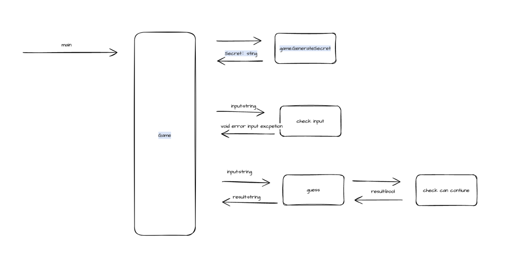

# Bulls and Cows

## Business Requirement

- There is a judge and a player in the game.  At the very beginning of every round of the game, the judge will randomly set a 4-digits number as secret(the digits must be all different). Then the player try to guess the secret. 

- The judge will answer the guess from player in form of ‘xAyB’. If the matching digits are in their right positions, they are “bulls”, if in different positions, they are “cows”. ’x’ represents the number of bulls, and ‘y’ represents the number of cows.

- In every round of game, the player has 6 chances to guess. 

- Each time judge answer the guess , it will give the results of the current guess and all guessed records(including guess and answer) for the player's reference.

For example: the secret is 1 2 3 4, then there are the following outputs based on different inputs
 
| Guess | Answer| Meaning of Answer|
| ------------- |:-------------:| -----:|
|1 5 6 7| 1A0B| '1' is correct |
|2 4 7 8| 0A2B|'2' & '4' are in wrong positions|
|0 3 2 4|1A2B| '4' is correct, '2' & '3' are in wrong positions|
|5 6 7 8|0A0B|all wrong
|4 3 2 1|0A4B|all in wrong positions
|1 2 3 4|4A0B|all correct
|1 1 2 3|Wrong Input, input again | Wrong Input, input again
|1 2|Wrong Input, input again  |Wrong Input, input again

## Practice Requirement

1. Draw the whole task diagram firstly.

2. Design and write tests for a task.
```angular2html
given : secret generator
when : new game
then: should set secret as generated
```
3. Implement the above task use TDD approach.
4. Repeat step 2&3 until all tasks are implemented.